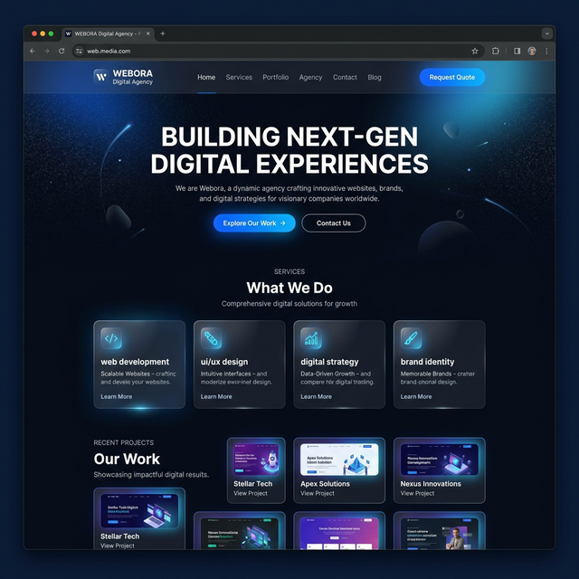

# 🌐 WEBORA – Digital Agency Website

A premium, modern, and fully responsive **Digital Agency Website** built to showcase real client portfolios, digital services, and team expertise. Designed with a sleek dark theme and glassmorphism aesthetics, powered by **React.js**, **Tailwind CSS**, and **Framer Motion**.



---

## 🚀 Live Demo

> ✨ **[https://web-ora.netlify.app/](https://web-ora.netlify.app/)**

---

## ✨ Features

### 🏗️ Multi-Page Architecture
- **Home** – Hero section, services overview, value proposition, customer reviews, and CTA
- **Services** – Detailed service offerings with dedicated service detail pages
- **Projects** – Real client portfolio showcase with live website previews
- **About** – Company story, mission, and team member profiles
- **Contact** – Professional contact form with company information

### 🌍 Bilingual Support (FR / EN)
- Full **French & English** language toggle built into the header
- All content dynamically switches between languages using a custom `LanguageContext`
- Reviews, navigation, hero content, and all sections support both languages

### 🎨 Premium Dark Theme Design
- Deep navy background (`#0A0F1C`) with **glowing blue accents** (`#0066FF`, `#00A3FF`)
- **Glassmorphism** card effects with backdrop blur and subtle borders
- **Gradient glow blobs** and ambient lighting effects throughout
- Smooth **gradient CTA buttons** with hover shadow animations

### 📂 Real Client Portfolio
- Showcases **4 real client projects** with live website links:
  - 🛍️ **KokoKids** – E-commerce for kids' clothing
  - 📋 **AMG Legisinn** – Professional consultancy website
  - 👗 **Ladies Closet** – Fashion e-commerce store
  - ✈️ **Savi Visa Consultant** – International visa services
- Modern **project cards** with hover animations, image zoom, and "Visit Website" floating button
- Tag-based categorization for each project

### ⭐ Customer Reviews Section
- Auto-rotating **testimonial carousel** with dot indicators
- Star ratings, client avatars, and bilingual review text
- Active card highlighting with glowing border effects

### 🎞️ Smooth Animations
- **Framer Motion** powered scroll-triggered animations
- Staggered grid reveals, fade-in transitions, and hover micro-interactions
- Arrow button rotation effects and card lift animations
- Scrolling ticker/marquee in the hero section

### 🧭 Modern Navigation
- **React Router** powered multi-page navigation
- **Breadcrumb navigation** on inner pages
- Responsive mobile-friendly header with smooth transitions

### 👥 Team Showcase
- Dedicated **About page** with team member profiles
- Avatar cards with hover glow effects and role descriptions
- Company mission and vision content with bilingual support

### 📱 Fully Responsive
- Mobile-first design optimized for all screen sizes
- Adaptive grid layouts and typography scaling
- Touch-friendly interactive elements

---

## 🛠️ Tech Stack

| Technology      | Usage                                    |
|-----------------|------------------------------------------|
| React 18        | Component-based UI library               |
| Tailwind CSS    | Utility-first responsive styling         |
| Framer Motion   | Scroll animations & micro-interactions   |
| React Router    | Client-side multi-page routing           |
| React Icons     | Icon integration (Heroicons, MdIcons)    |
| Vite            | Lightning-fast build tool & dev server   |
| Netlify         | Deployment & hosting                     |

---

## 📁 Project Structure

```
src/
├── assets/          # Project preview images
├── components/      # Reusable UI components
│   ├── ui/          # Breadcrumb, HeroMove, etc.
│   ├── Hero.jsx
│   ├── ServicesOverview.jsx
│   ├── ValueProposition.jsx
│   ├── CustomerReviews.jsx
│   ├── OurProjects.jsx
│   ├── OurServices.jsx
│   ├── ContactUs.jsx
│   ├── Footer.jsx
│   └── ...
├── context/         # Language context (FR/EN)
├── data/            # Projects data
├── pages/           # Route pages
│   ├── Home.jsx
│   ├── Services.jsx
│   ├── Projects.jsx
│   ├── AboutPage.jsx
│   └── Contact.jsx
└── styles/          # Custom CSS (Projects, Hero, etc.)
```

---

## 🚀 Getting Started

```bash
# Clone the repository
git clone https://github.com/jawad020/webora.git

# Navigate to the project
cd webora

# Install dependencies
npm install

# Start the development server
npm run dev
```

---

## 📦 Build for Production

```bash
npm run build
```

The production build will be output to the `dist/` directory.

---

## 🌐 Deployment

This project is deployed on **Netlify** with automatic deploys from the `main` branch.

- **Live URL**: [https://web-ora.netlify.app/](https://web-ora.netlify.app/)
- **Build Command**: `npm run build`
- **Publish Directory**: `dist`

---

## 📄 License

This project is proprietary software developed by **WEBORA Digital Agency**.

---

> Built with ❤️ by **WEBORA** – Transforming ideas into digital reality.
